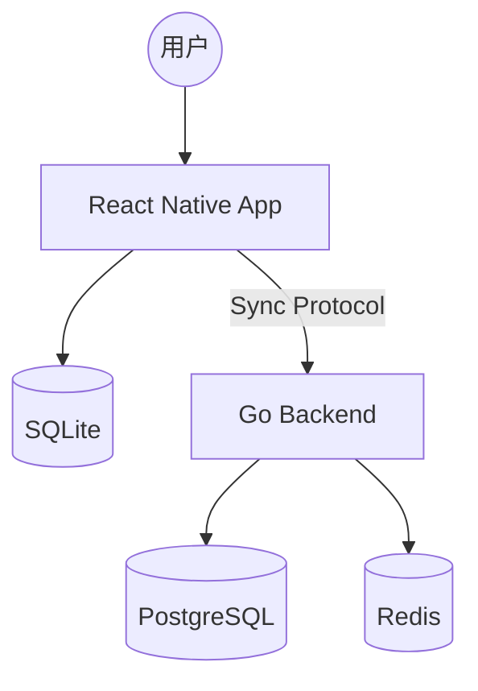

# Bookkeeping

> 一款基于 Local-First 原则的极致记账 App。拒绝臃肿，回归记账本质。

[]()
[](https://github.com/users/jones-187/projects/2)

---

## 💡 核心设计哲学

- **Local-First**：数据完全驻留在本地 SQLite，云端仅作增量备份，确保极致响应速度。
- **Financial Accuracy**：严禁使用浮点数，全链路采用 `decimal` 处理，确保每一分钱都准确无误。
- **Lightweight**：拒绝过度设计，保持代码库的简洁与可维护性。

## 🏗️ 系统架构



## 🛠 快速开始

### 环境要求

- Node.js v20+
- Go 1.22+
- Docker & Docker Compose

### 常用命令

```bash
make setup     # 一键安装所有依赖
make dev       # 启动全套开发服务
make test      # 运行所有测试
make lint      # 代码检查
```

### 数据库迁移

```bash
# 若修改了 Schema，请运行迁移
make migrate
```

## 📋 项目管理

本项目使用 **GitHub Projects** 进行全生命周期管理：

👉 **[查看项目看板](https://github.com/users/yourname/projects/1)**

| 状态 | 说明 |
|------|------|
| 🟢 Backlog | 待规划的需求 |
| 🟡 In Progress | 正在开发的 Feature |
| 🔴 Bug | 紧急修复事项 |

**工作流**：Issue → PR (`Fixes #123`) → Merge → 自动关闭 Issue

## 📚 文档导航

### 架构决策记录 (ADR)

所有重大架构决策均记录于 [docs/adr](docs/adr)：

- [ADR-001: Local-First 架构决策](docs/adr/ADR-001-local-first-architecture.md)
- [ADR-002: 技术栈选型](docs/adr/ADR-002-tech-stack-selection.md)

### 架构图

- [系统上下文图 (C4 L1)](docs/architecture/context.md)
- [容器架构图 (C4 L2)](docs/architecture/container.md)

### 开发规范

详细开发规范请参阅 [CONTRIBUTING.md](docs/CONTRIBUTING.md)。

## 🗂 项目结构

```
bookkeeping/
├── docs/                    # 文档中心
│   ├── adr/                 # 架构决策记录
│   ├── designs/             # 方案设计
│   └── architecture/        # 架构图 (Mermaid)
├── src/
│   ├── app/                 # 前端应用 (React Native + Expo)
│   └── server/              # 后端服务 (Go + Gin)
├── tests/                   # 测试目录
├── scripts/                 # 自动化脚本
└── Makefile                 # 常用命令
```

## ⚖️ 许可协议

MIT
