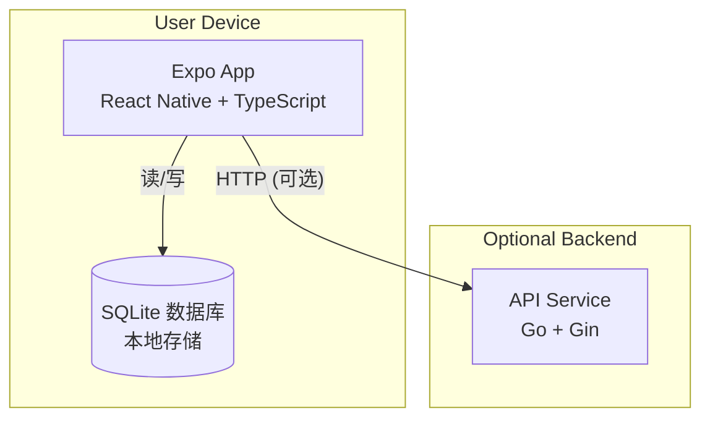

# 容器图 (C4 - Level 2)

最后更新：2026-04-05

此图描述当前系统的容器架构。



## 容器

| 容器 | 技术栈 | 当前职责 |
|------|--------|----------|
| Expo App | Expo 51 + React Native + TypeScript | 记账应用主程序 |
| SQLite | expo-sqlite | 本地数据持久化 |
| API Service | Go + Gin | 健康检查、启动元数据（未来同步） |

## 应用内部架构

```
┌─────────────────────────────────────────┐
│              UI Layer                    │
│  (screens, components)                  │
├─────────────────────────────────────────┤
│              Hooks Layer                 │
│  (useEntries, etc.)                     │
├─────────────────────────────────────────┤
│              Service Layer               │
│  (LedgerEntryService)                   │
│  - 业务规则验证                          │
│  - 金额转换（元/分）                     │
├─────────────────────────────────────────┤
│              Repository Layer            │
│  (LedgerEntryRepository)                │
│  - SQL 查询                              │
│  - 数据映射                              │
├─────────────────────────────────────────┤
│              Database Layer              │
│  (expo-sqlite)                          │
│  - ledger_entries 表                    │
└─────────────────────────────────────────┘
```

## 数据模型

### ledger_entries 表

| 字段 | 类型 | 说明 |
|------|------|------|
| id | TEXT | UUID 主键 |
| amount | INTEGER | 金额（分） |
| type | TEXT | income/expense |
| description | TEXT | 描述 |
| date | TEXT | 日期 YYYY-MM-DD |
| created_at | TEXT | 创建时间 |
| updated_at | TEXT | 更新时间 |
| deleted_at | TEXT | 删除时间（软删除） |

## 尚未实现

这些是未来计划的：

- 账户表 (accounts)
- 类别表 (categories)
- 云端 PostgreSQL
- Redis 缓存
- 身份验证服务
- 同步引擎
