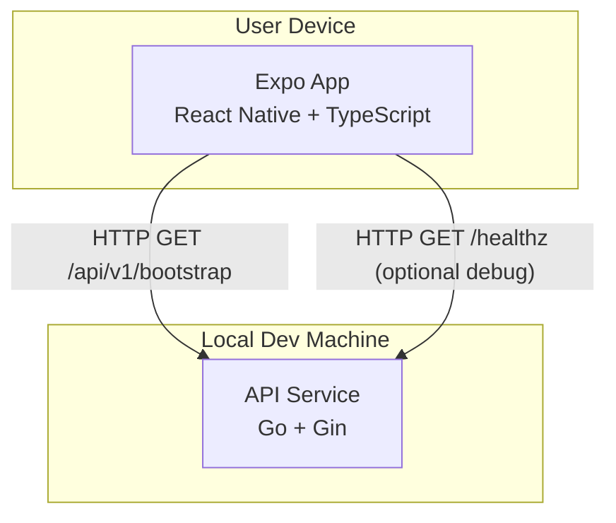

# 容器图 (C4 - Level 2)

最后更新：2026-03-27

此图描述当前已实现的可运行脚手架，而非完整的目标状态系统。

## 容器

| 容器 | 技术栈 | 当前职责 |
|------|--------|------|
| App | Expo + React Native + TypeScript | 渲染服务状态页面并调用 bootstrap API |
| API Service | Go + Gin | 暴露健康和 bootstrap 元数据端点 |

## 尚未实现

这些是稍后计划的，但不属于当前图表的一部分，因为代码尚不存在：

- SQLite 本地持久化
- 账目领域服务
- PostgreSQL
- Redis
- 身份验证
- 同步引擎
- 外部推送或对象存储集成
