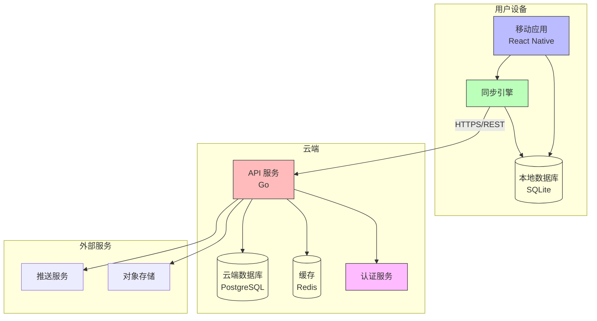

# 容器架构图 (C4 - Level 2)

展示系统内部的容器（应用、数据库、服务）及其交互。

## 容器说明

### 用户设备端

| 容器 | 技术栈 | 职责 |
|------|--------|------|
| 移动应用 | React Native | UI 展示、用户交互 |
| 本地数据库 | SQLite | 数据持久化、离线存储 |
| 同步引擎 | TypeScript | 增量同步、冲突解决 |

### 云端

| 容器 | 技术栈 | 职责 |
|------|--------|------|
| API 服务 | Go | 业务逻辑、数据接口 |
| 云端数据库 | PostgreSQL | 数据存储、事务支持 |
| 缓存 | Redis | 会话管理、热点数据 |
| 认证服务 | JWT | 用户认证、授权 |

## 数据流

### 本地操作流程
1. 用户在 App 中操作
2. 数据写入本地 SQLite
3. 同步引擎记录变更

### 同步流程
1. 同步引擎检测网络
2. 发送增量变更到 API
3. API 处理并返回结果
4. 同步引擎更新本地版本
