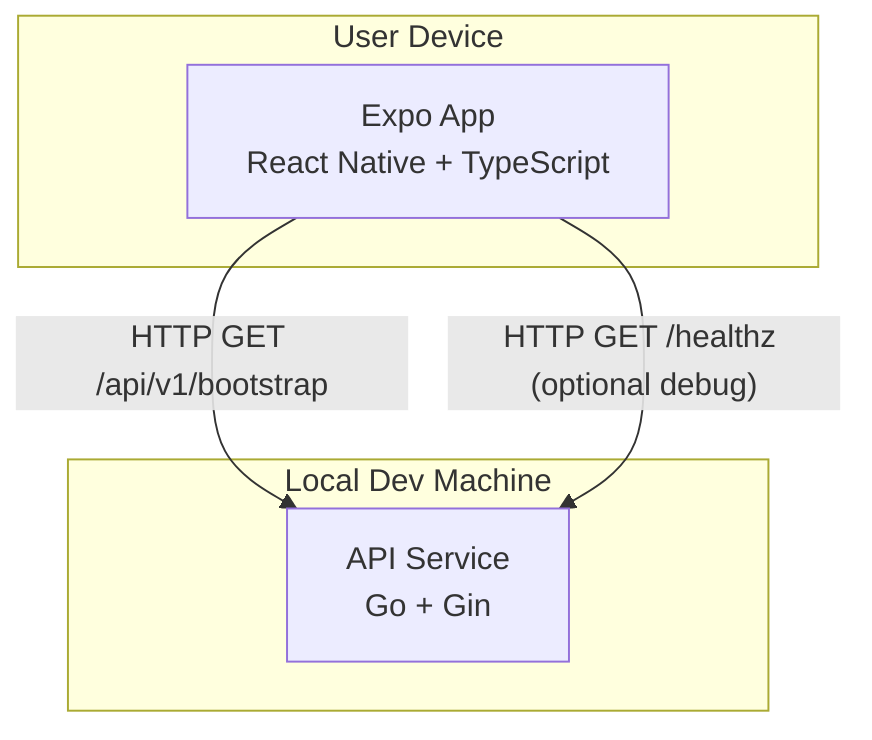

# Container Diagram (C4 - Level 2)

Last updated: 2026-03-27

This diagram describes the currently implemented runnable scaffold, not the full target-state system.

## Containers

| Container | Stack | Current responsibility |
|------|--------|------|
| App | Expo + React Native + TypeScript | Render the service status page and call the bootstrap API |
| API Service | Go + Gin | Expose health and bootstrap metadata endpoints |

## Not yet implemented

These are planned later, but are not part of the current diagram because the code does not exist yet:

- SQLite local persistence
- ledger domain services
- PostgreSQL
- Redis
- authentication
- sync engine
- external push or object storage integrations
