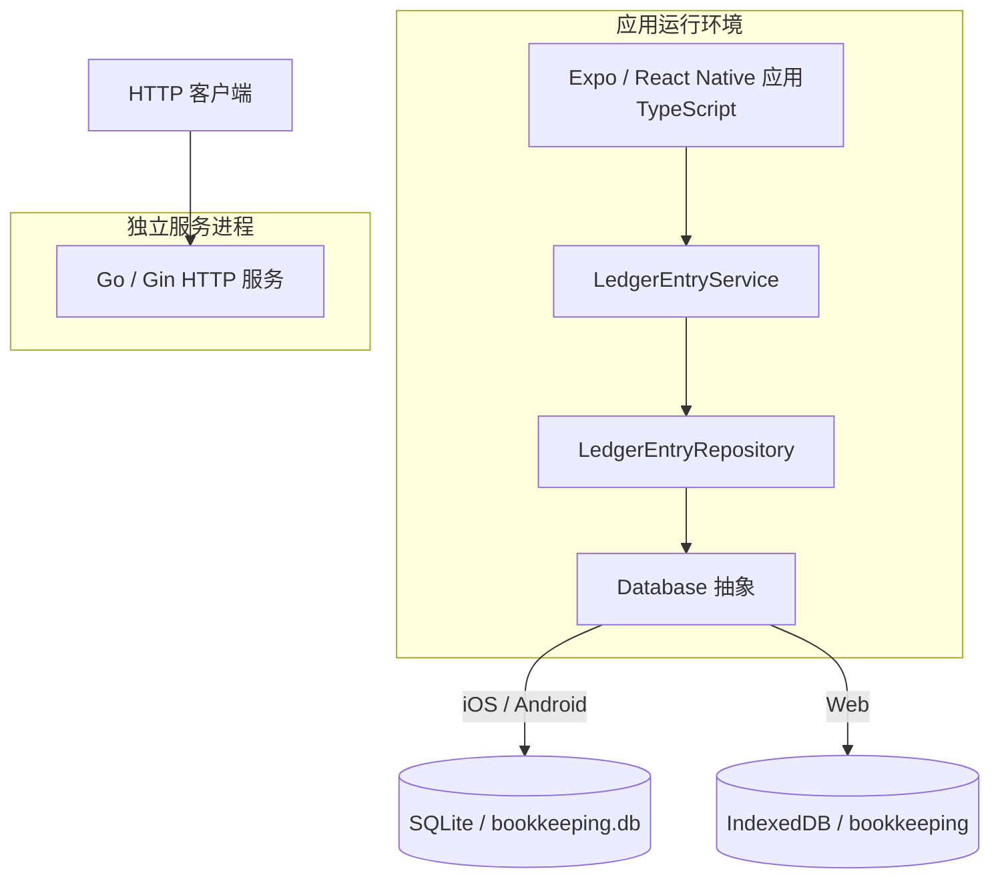

# 容器

| 容器或层 | 技术 | 职责 |
| --- | --- | --- |
| Expo 应用 | Expo、React Native、TypeScript | 渲染账目界面并编排 ledger 功能。 |
| `LedgerEntryService` | TypeScript | 校验输入、将元转换为分、计算汇总，并将操作委托给仓储。实现见 [LedgerEntryService](../../src/app/src/features/ledger/services/LedgerEntryService.ts)。 |
| `LedgerEntryRepository` | TypeScript | 生成条目 ID、执行数据访问、隐藏软删除记录，并把数据库行映射为领域实体。实现见 [LedgerEntryRepository](../../src/app/src/features/ledger/repositories/LedgerEntryRepository.ts)。 |
| `Database` | TypeScript 接口 | 以 `execAsync`、`runAsync`、`getFirstAsync`、`getAllAsync` 统一数据库操作。接口见 [interface.ts](../../src/app/src/shared/db/interface.ts)。 |
| SQLite 适配器 | `expo-sqlite` | iOS / Android 端打开数据库并运行迁移。实现见 [native-db.ts](../../src/app/src/shared/db/native-db.ts)。 |
| IndexedDB 适配器 | 浏览器 IndexedDB | Web 端实现同一接口，并将 SQL 形态的仓储操作映射为对象存储操作。实现见 [web-db.ts](../../src/app/src/shared/db/web-db.ts)。 |
| Go HTTP 服务 | Go、Gin | 提供两项无状态 JSON 端点；不保存或处理 ledger 数据。实现见 [bootstrap.go](../../src/server/internal/http/handler/bootstrap.go)。 |

应用在 [getDatabase](../../src/app/src/shared/db/index.ts) 中依据运行平台选择 SQLite 或 IndexedDB。HTTP 服务与应用的账目条目数据路径相互独立；当前应用源代码未调用服务端端点。

数据结构和约束见 [数据模型](data-model.md)。HTTP 端点见 [HTTP API](../api/http-api.md)。
