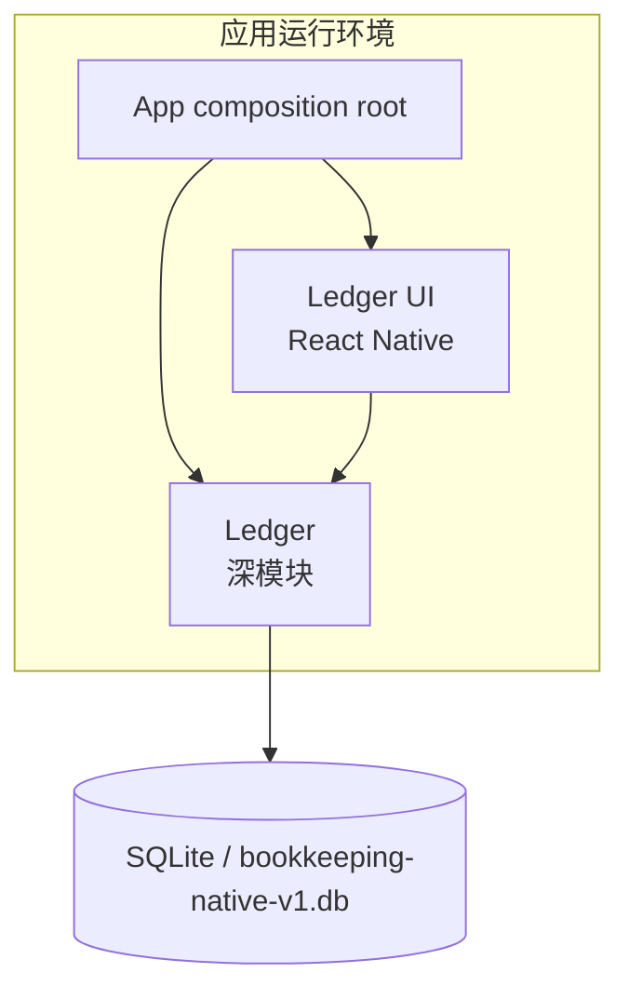

# 容器

| 容器或层 | 技术 | 职责 |
| --- | --- | --- |
| App composition root | Expo、React Native、TypeScript | 创建原生 Ledger，将它注入账目界面，并处理初始化状态。入口见 [App.tsx](../../src/app/App.tsx)。 |
| Ledger | TypeScript | 对外提供新增、更新、软删除与一致快照；内部完成输入校验、分单位运算、汇总、迁移和 SQLite 查询。契约见 [contract.ts](../../src/app/src/ledger/contract.ts)。 |
| SQLite 适配器 | `expo-sqlite` | 打开原生数据库、设置 SQLite 连接参数，并在排他事务中执行 Ledger 的内部迁移与读写。实现见 [native.ts](../../src/app/src/ledger/native.ts)。 |

账目界面仅依赖 `Ledger`，不会了解 SQLite SQL、迁移或数据行。SQLite 不是一个面向应用其他模块的通用存储服务；它是 Ledger 的内部细节。

数据结构和约束见 [数据模型](data-model.md)。
