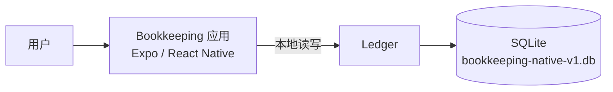

# 系统上下文

Bookkeeping 是一款本地优先的记账应用。用户在 iOS 或 Android 的 Expo / React Native 应用中创建、查看、更新和软删除账目条目；账目条目只保存在运行应用的设备中。

## 边界与职责

| 元素 | 当前职责 |
| --- | --- |
| 用户 | 通过应用维护收入和支出账目条目。 |
| Bookkeeping 应用 | 装配 Ledger 并提供账目界面。 |
| Ledger | 校验精确金额与日期、维护软删除可见性，并返回列表与汇总一致的快照。 |
| SQLite | iOS 与 Android 上的持久化存储，数据库文件名为 `bookkeeping-native-v1.db`。 |

账目读写不依赖网络或远程进程。应用的组合根创建原生 Ledger；对外只暴露 [Ledger 契约](../../src/app/src/ledger/contract.ts)，SQLite 连接、迁移和行映射均为该模块内部实现。
