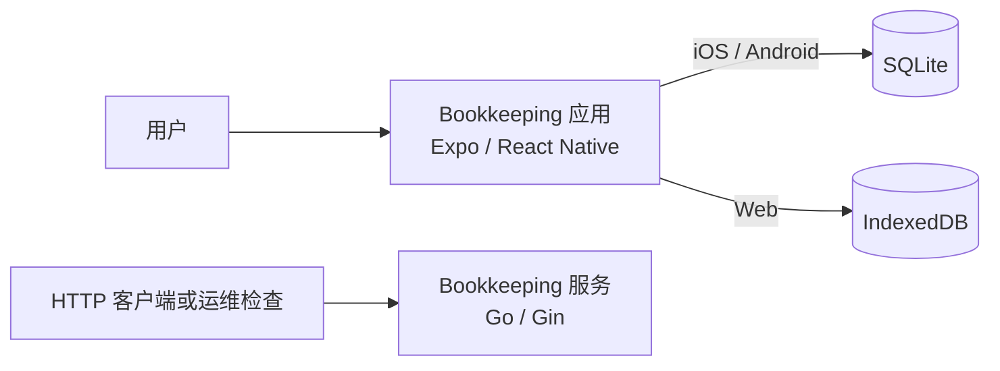

# 系统上下文

Bookkeeping 是一款本地优先的记账应用。用户在 Expo / React Native 应用中创建、查看、更新和软删除账目条目；账目条目数据保存在运行应用的设备或浏览器中。独立的 Go HTTP 服务提供健康检查和启动元数据，但不参与账目条目读写。

## 边界与职责

| 元素 | 当前职责 |
| --- | --- |
| 用户 | 通过应用维护收入和支出账目条目。 |
| Bookkeeping 应用 | 提供账目界面、业务校验、汇总计算和本地数据访问。 |
| SQLite | iOS 与 Android 上的持久化存储，数据库文件名为 `bookkeeping.db`。 |
| IndexedDB | Web 上的持久化存储，数据库名为 `bookkeeping`。 |
| Bookkeeping 服务 | 暴露 `GET /healthz` 与 `GET /api/v1/bootstrap`，返回服务状态和配置元数据。 |

账目条目读写不经由 HTTP：`LedgerEntryRepository` 从平台数据库抽象取得连接并直接操作 `ledger_entries`。参见 [仓储实现](../../src/app/src/features/ledger/repositories/LedgerEntryRepository.ts) 和 [平台选择](../../src/app/src/shared/db/index.ts)。

服务路由及处理器位于 [路由构建](../../src/server/internal/http/router.go) 与 [处理器](../../src/server/internal/http/handler/bootstrap.go)。
