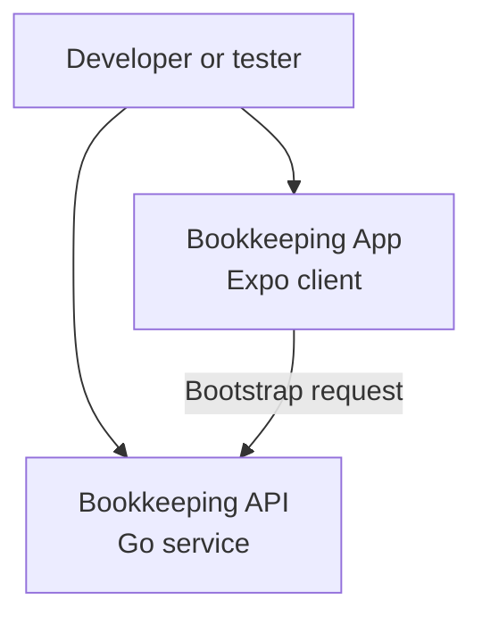

# System Context Diagram (C4 - Level 1)

Last updated: 2026-03-27

This diagram shows the currently implemented development-time system context.

## Notes

### User

- starts the Expo app locally
- starts the Go API locally
- uses the current scaffold to verify connectivity and UI states

### Bookkeeping App

- runs as an Expo / React Native application
- currently renders only the service status page
- requests startup metadata from the API

### Bookkeeping API

- runs as a local Go service
- currently exposes `GET /healthz` and `GET /api/v1/bootstrap`

## Future context

Local SQLite storage, cloud sync, and remote storage are part of the long-term direction, but they are not implemented in the current scaffold and are intentionally omitted from this diagram.
