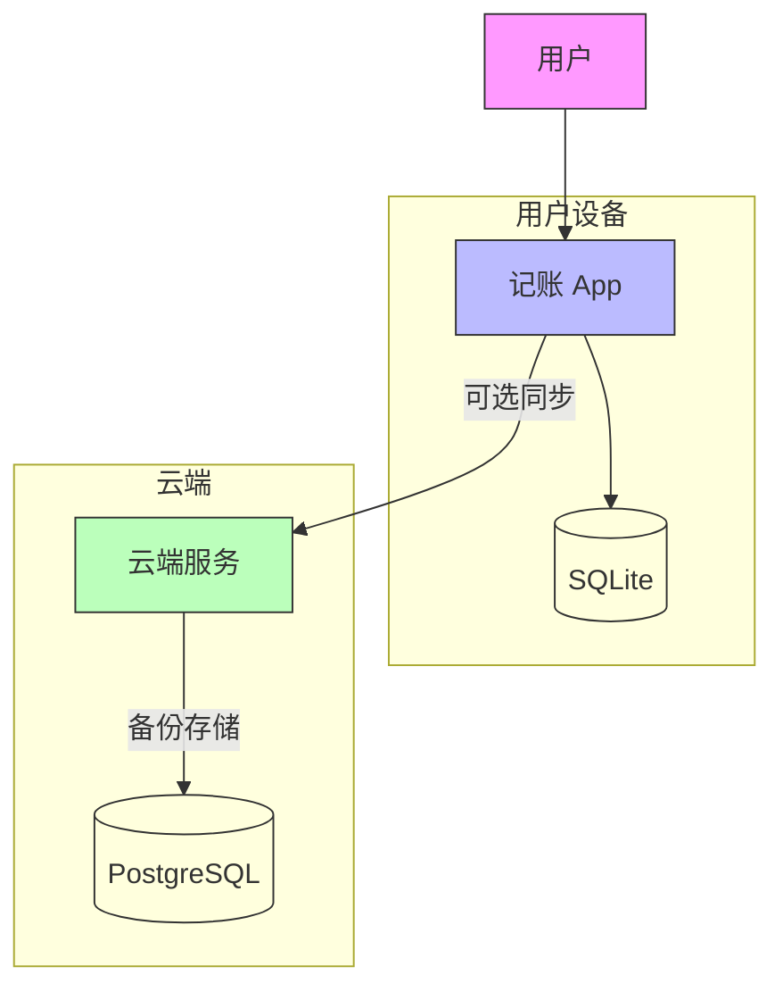

# 系统上下文图 (C4 - Level 1)

展示系统与外部用户和系统的交互关系。

## 说明

### 用户 (User)
- 个人记账用户
- 使用移动设备记录收支
- 期望离线可用、数据安全

### 记账 App (Mobile App)
- 运行在用户移动设备上
- 本地优先，离线完全可用
- 可选云端同步

### 云端服务 (Cloud Service)
- 可选的数据备份服务
- 支持多设备同步
- 用户可选择是否启用

### 数据存储
- **SQLite**：本地数据库，存储所有用户数据
- **PostgreSQL**：云端数据库，存储同步数据
