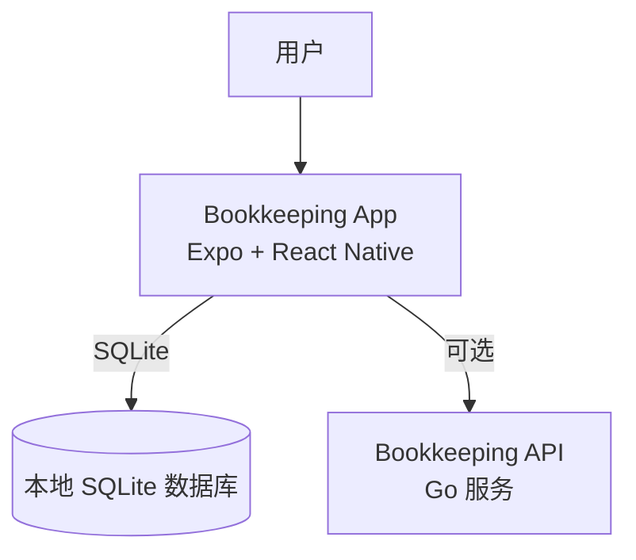

# 系统上下文图 (C4 - Level 1)

最后更新：2026-04-05

此图显示当前系统的上下文。

## 说明

### 用户

- 使用 Expo 应用记录日常收支
- 可完全离线使用
- 数据存储在本地设备

### 记账应用

- 作为 Expo / React Native 应用运行
- 使用本地 SQLite 存储所有数据
- 可选连接 API 进行未来同步

### 本地 SQLite 数据库

- 存储账目流水记录
- 存储账户和类别（阶段 2）
- 完全离线可用

### 记账 API（可选）

- 作为本地 Go 服务运行
- 暴露 `GET /healthz` 和 `GET /api/v1/bootstrap`
- 未来用于数据同步和备份

## 当前功能

- ✅ 账目流水 CRUD
- ✅ 收入/支出分类
- ✅ 收支汇总
- ✅ 本地数据持久化

## 未来扩展

- 云端数据备份
- 多设备同步
- 账户和类别管理
- 报表和可视化
