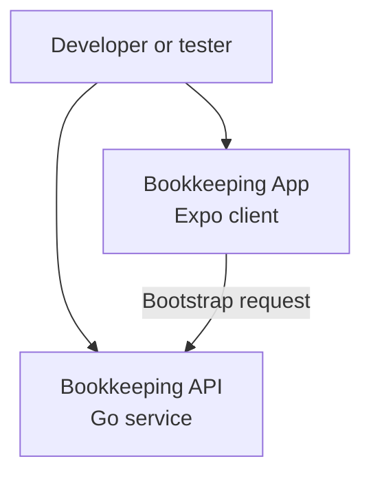

# 系统上下文图 (C4 - Level 1)

最后更新：2026-03-27

此图显示当前已实现的开发时系统上下文。

## 说明

### 用户

- 本地启动 Expo 应用
- 本地启动 Go API
- 使用当前脚手架验证连接性和 UI 状态

### 记账应用

- 作为 Expo / React Native 应用运行
- 当前仅渲染服务状态页面
- 从 API 请求启动元数据

### 记账 API

- 作为本地 Go 服务运行
- 当前暴露 `GET /healthz` 和 `GET /api/v1/bootstrap`

## 未来上下文

本地 SQLite 存储、云同步和远程存储是长期方向的一部分，但它们在当前脚手架中尚未实现，因此有意从此图中省略。
